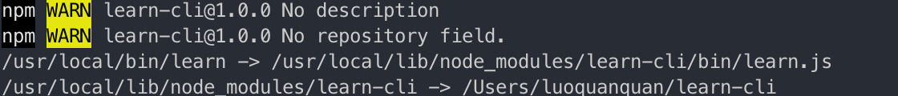

### 第一步：创建第一个命令
脚手架, 源自于建筑行业, 通俗的讲就是一个项目搭建的工具. 比较熟知的有 vue-cli create-react-app 等等，现在基于公司业务的需要，比如做活动页面时，都是统一的一个模板样式时，那么我们就可以根据场景搭建一个专属于活动的脚手架

##### 实现 node 和 shell 的交互
> 第一步我们先跑一个自己的 node 命令
> >首先创建一个项目目录, 根据惯例, 我们的脚手架也叫 cli, 就叫 ucar-cli 吧, 好好做人，好好做事
> >进入到目录，创建一个目录文件夹：mkdir ucar-cli
> >进入到ucar-cli：cd ucar-cli,初始化一个node项目 npm init -y
> >用编辑器打开项目，在package.json中添加代码：
> >
```
"bin": {
    "ucar": "./bin/ucar.js"
}
```
> >创建 bin 目录和 learn.js 文件, 在 learn.js 中添加以下代码. 文件头部的 #!/usr/bin/env node 这一句是告诉 shell 要以 node 来解析接下来的 learn 文件. 剩下的就是我们熟悉的 js 啦
> >
```
#!/usr/bin/env node
console.log('好好做人，好好做事')
```
> >通过终端进入到项目的根目录执行 npm link 如果出现以下提示说明 link 成功(如果报错的话，可能需要增加权限，用sudo去执行)
> >
> >此时, 在命令行中输入 ucar 试一下
> >

### 第二步：搭建开发环境
宝宝们请注意, 由于项目中用到了 async 函数, 所以 node 需要 v7.6.0+ 的版本

#### 配置 eslint 开启 vscode 自动修复
###### 配置 eslint
- 首先, 安装 eslint
```
npm i eslint -D
```
- 其次, 初始化 eslint 在项目的根目录下执行 ./node_modules/.bin/eslint --init
- 在命令行提示中选择第一个 Use a popular style guide 回车

- 接下来的提示中, 仍然选择第一个 Airbnb, 相对严格

- Do you use React? 写 n 然后回车.
- 配置文件格式选择默认即可

- 设置完配置文件格式以后, eslint 会自动检测依赖这里我们直接回车就可以啦~

- 下一步, 编辑器安装 eslint 插件

###### 开启 vscode 自动修复
- 第一步, 打开 vscode 配置文件 command + ,
- 第二步, 在功能搜索框中输入 autofix
- 第三步, 勾选Auto Fix On Save

