### 第一步：创建第一个命令
脚手架, 源自于建筑行业, 通俗的讲就是一个项目搭建的工具. 比较熟知的有 vue-cli create-react-app 等等，现在基于公司业务的需要，比如做活动页面时，都是统一的一个模板样式时，那么我们就可以根据场景搭建一个专属于活动的脚手架

##### 实现 node 和 shell 的交互
> 第一步我们先跑一个自己的 node 命令
> >首先创建一个项目目录, 根据惯例, 我们的脚手架也叫 cli, 就叫 ucar-cli 吧, 好好做人，好好做事
> >进入到目录，创建一个目录文件夹：mkdir ucar-cli
> >进入到ucar-cli：cd ucar-cli,初始化一个node项目 npm init -y
> >用编辑器打开项目，在package.json中添加代码：
> >
```
"bin": {
    "ucar": "./bin/ucar.js"
}
```
> >创建 bin 目录和 learn.js 文件, 在 learn.js 中添加以下代码. 文件头部的 #!/usr/bin/env node 这一句是告诉 shell 要以 node 来解析接下来的 learn 文件. 剩下的就是我们熟悉的 js 啦
> >
```
#!/usr/bin/env node
console.log('好好做人，好好做事')
```
> >通过终端进入到项目的根目录执行 npm link 如果出现以下提示说明 link 成功(如果报错的话，可能需要增加权限，用sudo去执行)
> >此时, 在命令行中输入 ucar 试一下
> >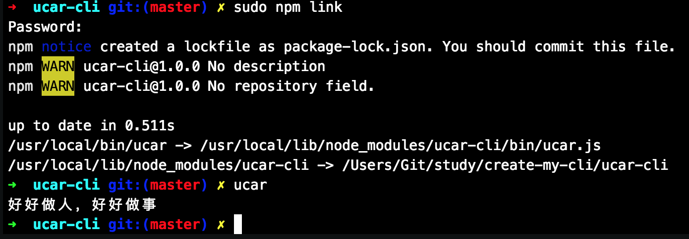

### 第二步：搭建开发环境
宝宝们请注意, 由于项目中用到了 async 函数, 所以 node 需要 v7.6.0+ 的版本

#### 配置 eslint 开启 vscode 自动修复
###### 配置 eslint
- 首先, 安装 eslint
```
npm i eslint -D
```
- 其次, 初始化 eslint 在项目的根目录下执行 ./node_modules/.bin/eslint --init
- 在命令行提示中选择第一个 Use a popular style guide 回车
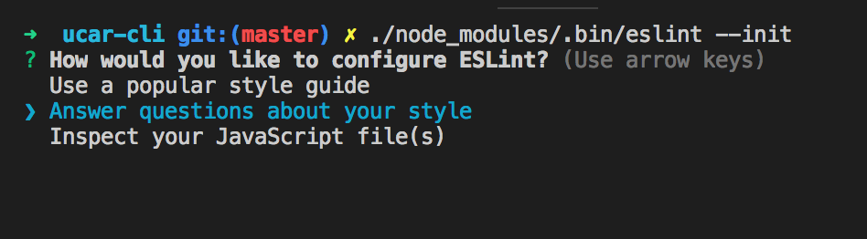
- 接下来的提示中, 仍然选择第一个 Airbnb, 相对严格
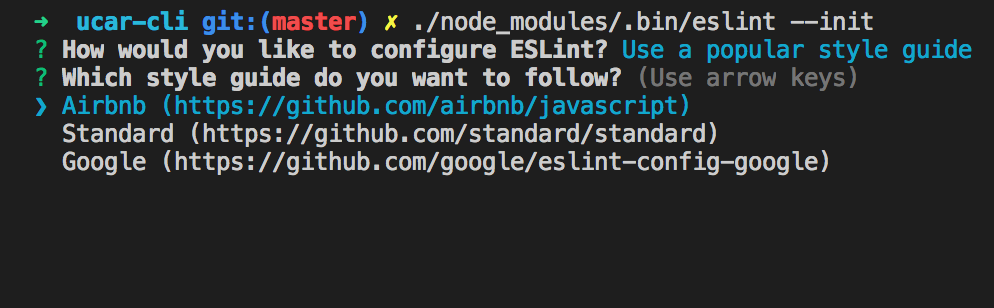
- Do you use React? 写 n 然后回车.
- 配置文件格式选择默认即可
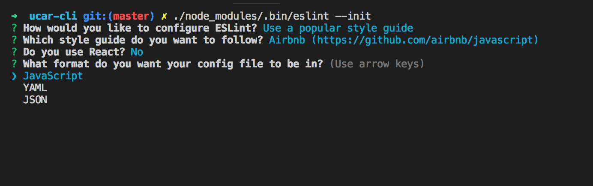
- 设置完配置文件格式以后, eslint 会自动检测依赖这里我们直接回车就可以啦~
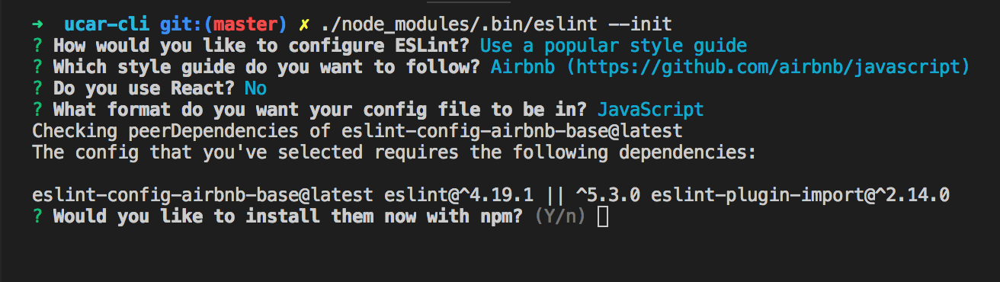
- 下一步, 编辑器安装 eslint 插件
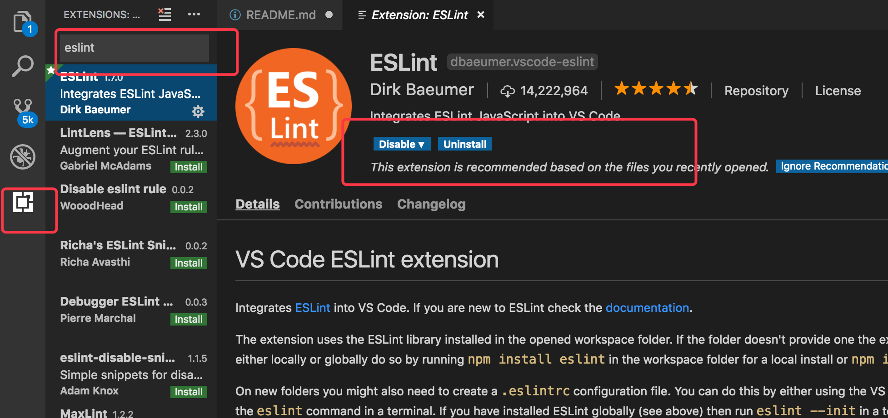

###### es6兼容
- 安装依赖
> >npm i @babel/core@7.1.6 babel-core@^6.26.3 babel-plugin-transform-es2015-modules-commonjs@6.26.2 babel-polyfill@6.26.0 babel-preset-env@1.7.0 babel-preset-latest-node@2.0.2 babel-register@6.26.0 -S
- 在项目的根目录中添加 .babelrc 在该文件中粘贴以下内容
```
{
    "presets": ["env"],
    "plugins": ["transform-es2015-modules-commonjs"]
}

```
- 在根目录下创建入口文件 index.js 并粘贴以下内容
```
require('babel-register');
const babel = require('@babel/core');
const babelPresetLatestNode = require('babel-preset-latest-node');

babel.transform('code();', {
  presets: [[babelPresetLatestNode, {
    target: 'current',
  }]],
});

require('babel-polyfill');
require('./src');

```
- 最后改造 bin/ucar.js 内容如下:
> >
```
#!/usr/bin/env node
require('../'); // 执行入口文件

```
###### 开启 vscode 自动修复
- 第一步, 打开 vscode 配置文件 command + ,
- 第二步, 在功能搜索框中输入 autofix
- 第三步, 勾选Auto Fix On Save
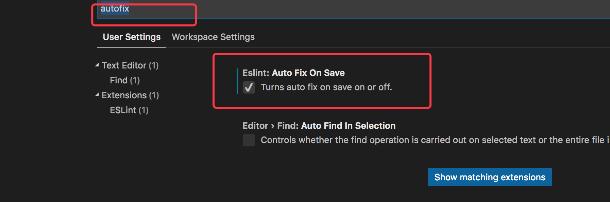
### 第三步, 获取我们上传到 github 上的项目信息
脚手架, 作为一个工具, 主要是用来搬运我们已经准备好的项目模板(webpack 配置, koa 项目雏形等等), 这一步我们就来创建用于搬运的项目模板. 并通过接口获取相关信息 [github Api](https://developer.github.com/v3/repos/) 文档

#### 创建一个专门用于维护项目模板的项目组（注意这里创建的是项目组即organization而不是repository）
- 创建好了一个项目组之后比如项目组（organization）,叫learnss-cli-organization
- 切换到该项目组下新建项目（repository）,比如叫ucar-cli
- 向创建的项目中添加一个文件, 上传到 github 并打好 tag
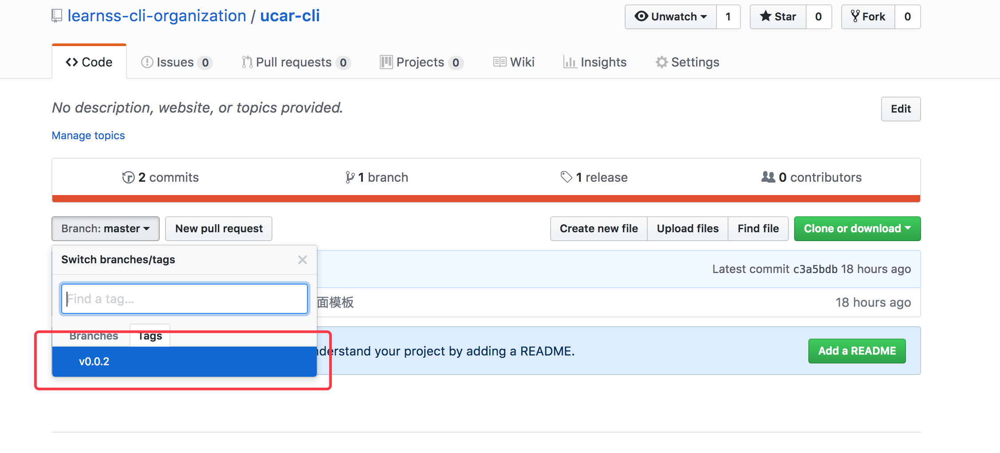
#### 通过 github 开放 api 获取项目信息

baseUrl: api.github.com

作为一个开发工具, 我们需要获取的项目信息包含以下几个:
1. 获取组织所属项目列表
> >我们可以尝试一下获取刚刚创建的 organization 下的项目目录
> >curl https://api.github.com/orgs/learnss-cli-organization/repos
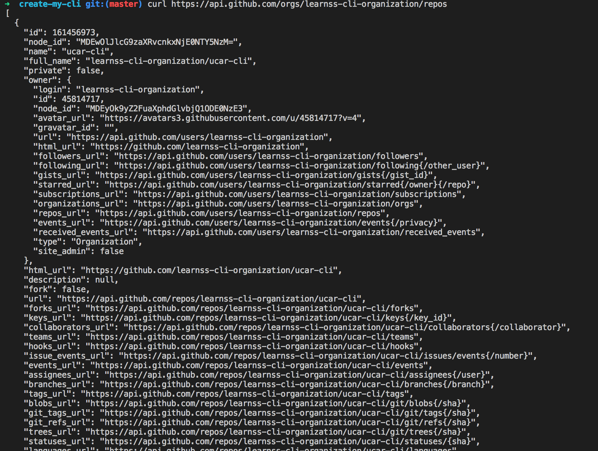
> >拿到这个数组说明我们已经能够获取到项目组中的所有项目啦
2. 获取指定项目的版本号
> >通过前一个接口, 我们成功的获取到了项目组中所有的项目信息, 接下来我们可以通过以下接口获取到指定项目的版本信息(就是 tags)
> >curl https://api.github.com/repos/learn-cli-organization/demo/tags
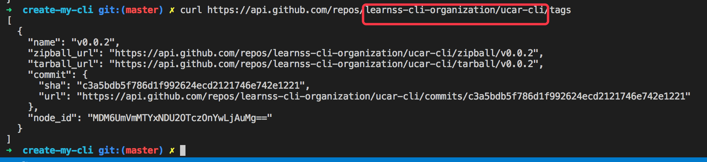
### 第四步, 通过代码获取项目信息
前面我们已经能够获取到命令行中输入的参数, 也能通过 github 开放 api 中获取到项目模板信息, 这里我们开始把之前的功能连缀起来

这里用到的工具较多：
- 获取命令行指令 commander (npm i commander -S)
- 命令行交互工具 inquirer (npm i inquirer -S)
- 命令行显示加载中 ora (npm i ora -S)
- ajax 封装库 axios (npm i axios -S)
目录结构如下：

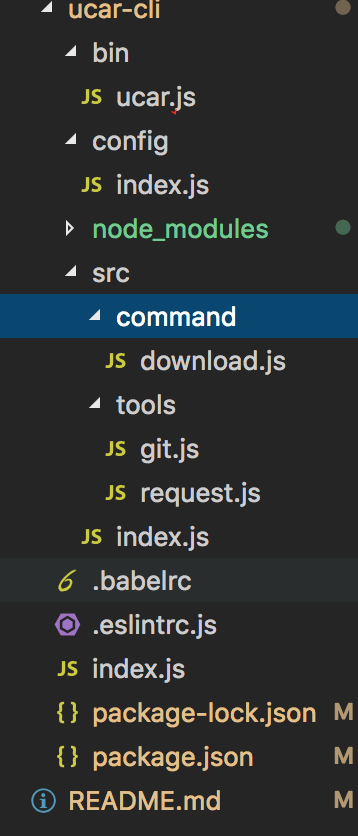

###### 各个文件介绍：
- bin/ucar.js 
> >仍然作为项目的引导文件, 直接引入项目根目录下的 index.js
- index.js 
> >根目录下的 index 作为项目的入口文件, 它的职责主要是兼容 es6, 并导入项目主文件 src/index.js
- src/index.js 
> >这个是项目的主文件, 也是整个程序的总控. 正如注释, 执行命令前, 从这里检测我们的命令目录下是否已经存在了用户请求的命令, 避免了用户误操作程序报错的风险.
- command/download.js
> >command 目录下存放的是我们整个项目中所有的命令文件, 不同的命令对应不同的文件, 体现了单一职责的设计. download 命令用到了我们上一节中提到的两个接口(即获取项目列表和获取版本号列表)
- tools/git.js
> >此文件是 git 相关的操作的文件, 由于脚手架的核心功能就是获取项目的 github 地址, 并下载, 所以我的 Git 类规划了以上几个功能, 获取项目列表 获取项目版本号列表 获取项目地址 下载项目
- tools/request.js
> >这个文件仅仅是对 axios 做了一层简单的封装
- config/index.js
> >作为整个项目的配置文件, 承担了保存项目运行过程中需要的配置信息的功能

- 输入ucar download 得到如下结果
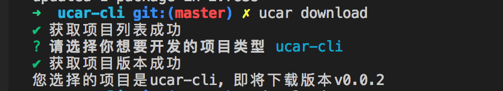
> >其中ucar这个命令是在package.json中bin配置的node命令，通过ucar这个指令启动bin目录下的ucar.js

### 第五步, 收工
拿到 git 项目信息是重要的一个环节. 然而, 只能拿到信息不能下载下来, 你这脚手架有个🔨用.我们就开始把 git 项目下载下来. 并且把完成的代码发布到 npmjs.com 上

###### 首先安装依赖 download-git-repo
- npm install download-git-repo -S
###### 扩充 Git 操作类
- 完善 Git 类的 downloadProject 方法:
```
downloadProject({ repo, version, repoPath }) {
    return new Promise((resolve, reject) => {
        download(`${this.orgName}/${repo}#${version}`, repoPath, (err) => {
        if (err) reject(err);
        resolve(true);
        });
    });
}

```
- 优化 command/download.js 文件,
```
// 向用户咨询欲创建项目的目录
const repoName = [
    {
    type: 'input',
    name: 'repoPath',
    message: '请输入项目名称: ',
    validate(v) {
        const done = this.async();
        if (!v.trim()) {
        done('项目名称不能为空~');
        }
        done(null, true);
    },
    },
];
const { repoPath } = await this.inquirer.prompt(repoName);

// 下载代码到指定的目录下
try {
    downLoadLoad = this.downLoad.start();
    await this.git.downloadProject({ repo, version, repoPath });
    downLoadLoad.succeed('下载代码成功');
} catch (error) {
    console.log(error);
    downLoadLoad.fail('下载代码失败...');
}
```
> >增加了向用户询问项目开发目录和调用代码下载功能的逻辑. 至此, 我们已经可以正常的下载模板代码啦.

### 将代码发布到 npm 上
- 首先, 创建 [npmjs](https://www.npmjs.com/) 账号
- 再次, 把 npm 镜像替换为官方镜像 重点要考
> >npm config set registry http://registry.npmjs.org
- 最后, 来一把 npm publish
> >没有任何意外的报错了, 但是通过看报错信息, 这是要让我们登录还给出了登录的命令
- 根据报错信息, 执行 npm adduser
- 登录后,再次执行 npm publish
